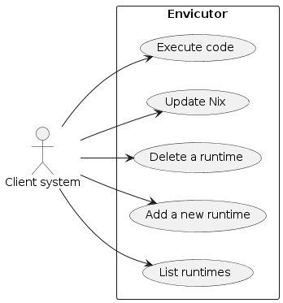

Requirements and use cases
##########################

Requirements
************

Functional requirements
=======================

Runtimes and Nix
----------------

- The client system shall be able to list all of the runtimes that were installed on Envicutor, Envicutor shall return a list of runtimes containing the id and name of each runtime

- The client system shall be able to add a new runtime on Envicutor, specifying the following:

  - The name of the runtime to add
  - The Nix shell that is required to make the packages available in the environment of the runtime as described in ":ref:`envicutor_nix`"
  - The compile script (if any) that is required to compile submission's code using this runtime
  - The run script that is required to run submission's code using this runtime
  - The name of the main source file that shall be given to the submitted code in single-file submissions

- The client system shall be able to delete runtimes that were added on Envicutor
- The client system shall be able to update the installation of the Nix package manager on Envicutor while Envicutor is running

.. _configuration:

Configuration
-------------

- The system deployer shall be able to configure the maximum values of: wall time, cpu time, memory, extra time, maximum number of open files, maximum file size, and the maximum number of processes that submissions can request
- The system deployer shall be able to configure the maximum number of submissions that can run concurrently on the system
- The system deployer shall be able to configure which port Envicutor binds to

Submissions execution
---------------------

- The client system shall be able to request the execution of code file using a certain runtime, specifying:

  - The runtime id of the runtime
  - The source code that is written in the file
  - The standard input that shall be given to the code execution process (if any)
  - Compilation limits (wall time, cpu time, memory, extra time, maximum number of open files, maximum file size, and the maximum number of processes) that do not exceed Envicutor's configured compilation limits (if any)
  - If the runtime requires compilation and no compilation limits were provided, Envicutor's configured compilation limits shall be used
  - Running limits (wall time, cpu time, memory, extra time, maximum number of open files, maximum file size, and the maximum number of processes) that do not exceed Envicutor's configured running limits
  - If no running limits are provided, Envicutor's configured running limits shall be used

- The client system shall be able to request the execution of a multi-file project using a certain runtime, specifying all of the above except for the source code which shall be a base64 encoded string of the zip archive of the project

- After execution, the client system shall be able to receive extraction metrics (if the submission is a multi-file project that is provided as a zip), compilation metrics (if the used runtime requires compilation), and running metrics. These metrics are:

  - The used memory
  - The exit code of the process (if any)
  - The exit signal of the process (if any)
  - The exit message of the process which is a human-readable message that describes what happened to the process (if abnormal activity such as exceeding time limit happened)
  - The exit status of the process which is a machine-readable string that describes what happened to the process (if abnormal activity happened). It shall be one of :cite:`isolate-manual`:

    - RE: indicating a runtime error
    - SG: indicating that the process died on a signal
    - TO: indicating that the process exceeded either the CPU or the wall time limit
    - XX: indicating an internal error of the sandbox
  - The standard output that the submission's processes produced
  - The standard error that the submission's processes produced
  - The CPU time consumed by the submission. The CPU time is the amount of time the CPU was actually working on the submission's processes. This excludes time in which the CPU context-switched to other processes due to scheduling, idle time, and blocked time (waiting for external IO resources)
  - The wall time consumed by the submission. The wall time is the total amount of time that the submission's processes stayed on the system whether or not the CPU was working on them for the entirety of this period

Non-functional requirements
===========================

Isolation and security
----------------------

- Submissions shall not be able to:

  - Communicate via reading and writing to files
  - Communicate via the local network
  - Read sensitive data on the host system (Envicutor)
  - Write any residual files on the host system (Envicutor)
  - Gain knowledge of any other processes running on the host system (Envicutor)
  - Affect each others CPU time
  - Starve each other from memory, file descriptors, or number of processes (with a properly configured system)
  - Exceed the limits specified in the execution request (if any), or the system limits

Performance and concurrency
---------------------------

- No startup overhead is tolerable for submissions, the CPU time shall only reflect the submission's CPU time

  - The Nix shell environment shall be cached as explained in ":ref:`nix_slow_startup`"

- New submissions shall be blocked if there is a running installation process or a running Nix update till it finishes
- Runtime installation shall be blocked if there are running submissions, another running installation or a running Nix update
- Nix updates shall be blocked if there are running submissions, another running Nix update, or a running runtime installation process
- Submissions, runtime installations and Nix updates shall be queued in a fair manner
- No deadlocks shall be tolerated between submissions, runtime installations and Nix updates

Package management
------------------

- Different versions of the same package can co-exist on Envicutor
- Packages with conflicting dependencies can co-exist on Envicutor

Use case diagram
****************

The following use cases represent the functional requirements that a client system can perform. Unlike traditional CRUD (Create, Read, Update, Delete) business applications, where use cases are plentiful and often repetitive, the use cases in the Envicutor are more limited and specialized. This scarcity is due to the system's emphasis on technical concepts and specific functionalities rather than on generic, repetitive operations:

  Envicutor's use case diagram
