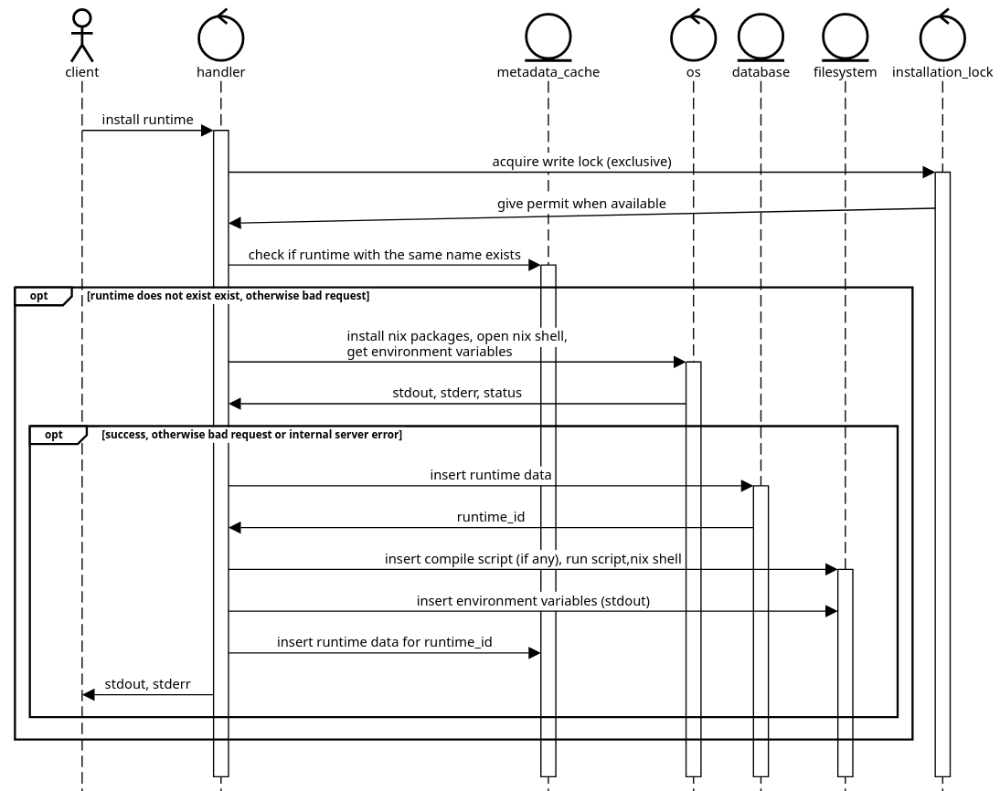

System design diagrams
######################

System component diagram
************************

The following diagram shows the modules :cite:`rust-modules` that are used in Envicutor.

  Envicutor's component diagram

The API module contains the following modules:

- The ``listing`` module contains the handlers :cite:`axum-handler` and functions for listing runtimes
- The ``deletion`` module contains the handlers and functions for deleting runtimes
- The ``execution`` module contains the handlers and functions for executing submissions
- The ``installation`` module contains the handlers and functions for adding runtimes and updating Nix
- The ``common_function`` module contains common functions that are used in handlers
- The ``common_responses`` module contains common API response structs that are used in handlers

The rest of the modules are:

- The ``types`` module contains type aliases and structs that are commonly used
- The ``isolate`` module contains abstractions for using Isolate sandboxes (check ":ref:`isolation_tools`") and ensuring their cleanup
- The ``globals`` module contains global constants that are used in the code
- The ``transaction`` module contains abstractions for simulating SQLite database transaction rollbacks
- The ``strings`` module contains utilities that are used to deal with strings
- The ``temp_dir`` module contains abstractions for creating a temporary directory and ensuring its cleanup
- The ``limits`` module encapsulates logic for verifying a submission's request limits against the configured system limits as described in ":ref:`configuration`"
- The ``fs`` module contains utilities for dealing with the filesystem
- The ``main`` module contains the entry point of the application

Class diagram
*************

Rust provides different ways to implement object-oriented principles compared to typical Java object-oriented code :cite:`rust-oop`. For example, while Rust does not support inheritance, it uses traits to define shared behavior, serving as an alternative to inheritance and polymorphism :cite:`rust-inheritance` :cite:`rust-traits`. Encapsulation is managed via the module system, which controls the visibility of functions, structs, and other items :cite:`rust-encapsulation`.

As a result, using UML class diagrams to represent our Rust codebase can be challenging. For example, how does one represent implementing a local trait for an external struct? How does one represent public/private module functions and constants that are not associated with a struct? Unique aspects of Rust like these require adaptations or extensions to traditional UML diagrams to accurately model the codebase.

As a result we believe the component diagram, along with the explanation of each component, should be sufficient to provide an overview of how the system works. That said, the following are class diagrams that attempt to show a simplified overview of Envicutor's design.

Functions and constants that are not associated with a struct are placed in UML classes called ``mod``. Note that some associations will not be shown in the following class diagrams for simplicity.

.. figure:: figures/class-diagram-api-mod.png
  :alt: api mod class diagram

  A class diagram of the API module and the modules inside of it

.. figure:: figures/class-diagram-root-crate.png
  :alt: root crate class diagram

  A class diagram of the rest of the modules

Sequence diagrams
*****************

Adding a new runtime
====================

The following sequence diagram shows an overview of how a new runtime is added to the system. It also shows how the environment variables from the Nix shell are cached as described in ":ref:`nix_slow_startup`":

  Sequence diagram for adding a new runtime

Listing the available runtimes
==============================

.. figure:: figures/listing-runtimes-sequence.png
  :alt: listing runtimes sequence diagram

  Sequence diagram for listing the available runtimes

Deleting a runtime
==================

.. figure:: figures/deleting-runtime-sequence.png
  :alt: deleting runtime sequence diagram

  Sequence diagram for deleting a runtime

Updating Nix installation
=========================

.. figure:: figures/updating-nix-sequence.png
  :alt: updating nix sequence diagram

  Sequence diagram for updating Nix installation

Executing code
==============

.. figure:: figures/execute-code-sequence.png
  :alt: code execution sequence diagram

  Sequence diagram for executing code (submissions)
