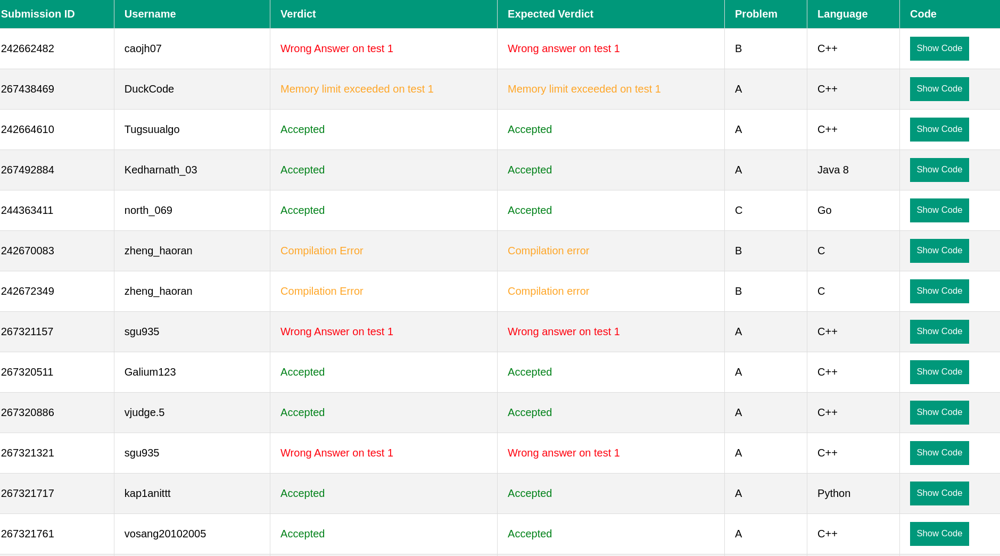
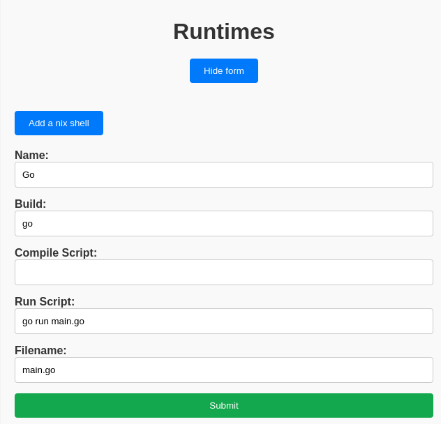
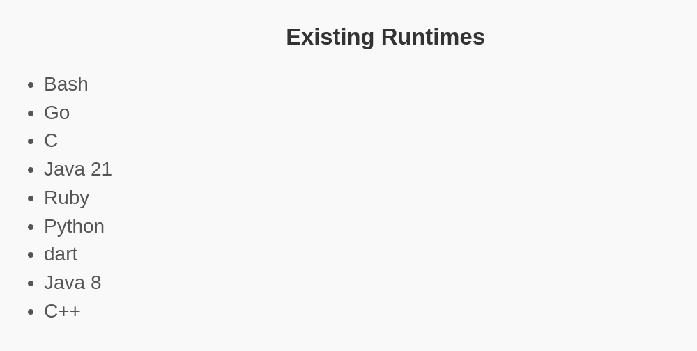
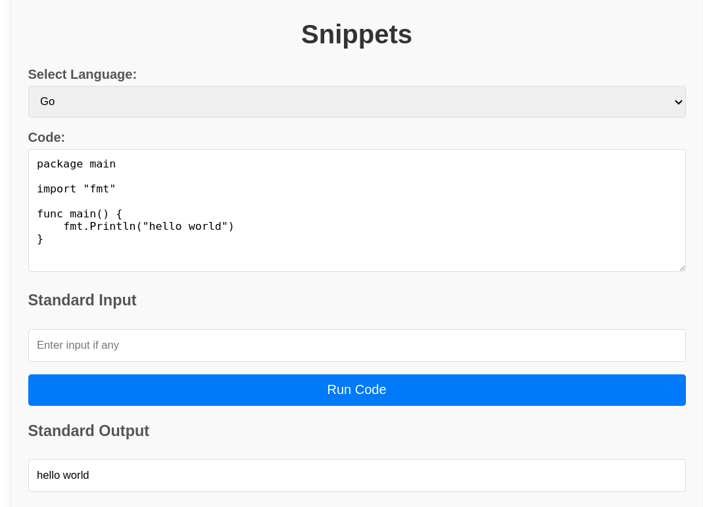

Implementation and Testing
##########################

Introduction
***************

This section describes the testing methodologies and implementation strategies used to ensure the robustness and reliability of Envicutor. The system was built to handle code submissions, execute them against predefined test cases, and return the results. To validate its effectiveness, we developed a web application that simulates a coding contest environment. This allowed us to test the system under real-world conditions, including concurrent submissions and the handling of malicious inputs.

Testing Methodologies
*********************

Our testing approach comprised various methodologies to throughly evaulate the Envicutor's performance and resilience.

Simulation Testing
==================

**Objective**: Validate the overall functionality and performance of Envicutor in a realistic environment.

**Approach**:

* Deployed the web application to simulate a competitive programming contest, providing a real-world usage scenario for Envicutor.
* Monitored system performance and response times under normal and peak loads.
* Assessed the system's ability to handle various types of submissions, including correct solutions, incorrect solutions, and edge cases.
* Ran a Python script that continuously sends malicious code during the contest to test Envicutor's resilience against harmful inputs and its ability to maintain integrity under attack.

**Screenshots**:

The following screenshot shows a simulated contest's results and the verdicts returned by Envicutor against the original verdicts of their respective submissions on Codeforces, where we gathered our dataset.

  Contest Result

API Testing
============

**Objective**: Validate the overall functionality and performance of Envicutor in a realistic environment.

**Approach**:

* Developed JavaScript scripts to perform comprehensive API testing, covering all endpoints and typical usage scenarios.

* Conducted automated tests to ensure the API handles valid and invalid requests appropriately.

* Evaulated the API's performance under concurrent access conditions.

  Adding a runtime environment

  Runtime Added successfully

  Runtime environment being used

Security Testing
================

**Objective**: Ensure that Envicutor can handle malicious inputs and maintain system integrity.

**Approach**:

* Injected malicious submissions during the contest simulation to test the system's resilience against code injection, infinite loops, and resource exhaustion attacks.
* Implemented sandboxing and resource-limiting measures to contain and mitigate the impact of malicious code.

Stress Testing
==============

**Objective**: Ensure that Envicutor can operate normally and efficiently under increased work loads.

**Approach**:

* Implemented a script that sends 5000 concurrent Python submissions and 300 C++ submissions in parallel.
