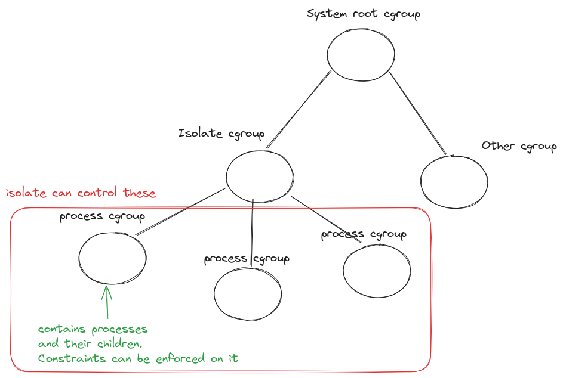

Comparing Envicutor and other code execution systems
####################################################

Isolation
*********

In this section, we discuss different levels of isolation implemented by different code execution systems and which level Envicutor chooses:

Isolation via running all submissions under a different user than the code execution system (Online IDE)
========================================================================================================

The first Google search for "Online IDE" brings us to a system called Online IDE :cite:`online-ide`. Choosing "bash" as the programming language and running the following code at some point in time:

.. code-block:: bash

  ps aux

gives us the following output:

.. code-block::

  PID   USER     TIME  COMMAND

      1 root      0:06 node server_8080.js
    406 repl      0:00 python3 -i
    686 repl      0:00 python3 main.py
    698 repl      0:00 sh main.sh
    699 repl      0:00 ps aux

This output represents all of the processes that are running on the system. We can see multiple python processes that are not started by us but are started by the same user as ours. We can conclude that in this system, all submissions run under the same user (repl), while the code execution system (PID 1) runs under the root user (root).

This is an ineffective way of doing isolating submissions (which might be OK depending on their requirements). For instance, had we run the command ``killall python3`` instead of ``ps aux``, the python submissions of other users would have been terminated. Moreover, submissions can write into each others directories and read from each other.

Such isolation method would not be appropriate for running a code execution system that is used in competitive programming systems and assignment graders.

Isolation via running each submissions under a different user (Piston)
======================================================================

If, at some point in time, we run the following Bash command to send two Bash ``ps aux`` submissions to Piston :cite:`piston-repo` code execution system:

.. code-block:: bash

  curl -X POST https://emkc.org/api/v2/piston/execute -H 'Content-Type: application/json' -d '{"language": "bash", "version": "*", "files":[{"content": "ps -eo user:20,pid,pcpu,pmem,comm"}]}' | jq & curl -X POST https://emkc.org/api/v2/piston/execute -H 'Content-Type: application/json' -d '{"language": "bash", "version": "*", "files":[{"content": "ps -eo user:20,pid,pcpu,pmem,comm"}]}' | jq

and observe the standard output of one of the submissions, we would notice the following output:

.. code-block::

  USER                   PID %CPU %MEM COMMAND
  root                     1  1.0  2.1 node
  runner1066            3569  0.0  0.0 timeout
  runner1067            3570  0.0  0.0 timeout
  runner1066            3571  0.0  0.1 bash
  runner1067            3572  0.0  0.1 bash
  runner1066            3573  0.0  0.1 bash
  runner1067            3574  0.0  0.1 bash
  runner1066            3575  0.0  0.1 ps
  runner1067            3576  0.0  0.0 bash

This output represents all of the processes that are running on the system. We can see that there are two users who started a bash process (runner1066, runner1067). These two users represent our two submissions that we sent. The code execution system is running under the root user.

While this approach prevents some exploits such as killing other submissions' processes and reading/writing to other submissions' files, there are still some caveats.

The first obvious caveat is that the submissions are aware of each other's existence on the system which violates the principles of isolation we discussed in ":ref:`improvement_areas`".

Another caveat is that submissions can read and write to shared directories such as ``/tmp`` which also violates the principles of isolation. Consider the following two bash submissions

.. code-block:: bash

  echo -e "#!/bin/bash\necho This is a long line. This is a long line $((1+1))" > /tmp/a
  chmod a+x /tmp/a
  sleep 3

.. code-block:: bash

  /tmp/a

If we send the first submission, wait for 500 ms, and send the second submission, we would notice the following standard output in the second submission:

.. code-block::

  This is a long line. This is a long line 2

The second submission was able to run code that the first submission placed in ``/tmp/a``. In addition to being a risk for competitive programming contests, this can also be detrimental to contests styles like code golf :cite:`code-golf-stack-exchange` which ranks submissions by their number of characters.

Isolation using isolation tools (Judge0, Envicutor)
===================================================

Judge0 :cite:`judge0-repo` uses Isolate :cite:`isolate-repo` process isolation tool to isolate submissions from each other. This tool uses certain features of the Linux kernel such as namespaces and control groups to isolate processes from each other and control their execution limits as explained in ":ref:`isolation_tools`".

Insecure Isolate ``--share-net`` option
---------------------------------------

Isolate by default does not allow network access inside sandboxes. Judge0 has a configuration option that can enable submissions to choose whether or not they want internet access while executing the submission. If this configuration option is enabled, and if the submissions choose to have internet access, Judge0 will make use of the ``--share-net`` option in Isolate as seen in Judge0's code :cite:`judge0-share-net`:

.. code-block:: ruby
  :emphasize-lines: 6

  command = "isolate #{cgroups} \
  -s \
  -b #{box_id} \
  -M #{metadata_file} \
  #{submission.redirect_stderr_to_stdout ? "--stderr-to-stdout" : ""} \
  #{submission.enable_network ? "--share-net" : ""} \
  -t #{submission.cpu_time_limit} \
  -x #{submission.cpu_extra_time} \
  -w #{submission.wall_time_limit} \
  -k #{submission.stack_limit} \
  -p#{submission.max_processes_and_or_threads} \
  #{submission.enable_per_process_and_thread_time_limit ? (cgroups.present? ? "--no-cg-timing" : "") : "--cg-timing"} \
  #{submission.enable_per_process_and_thread_memory_limit ? "-m " : "--cg-mem="}#{submission.memory_limit} \
  -f #{submission.max_file_size} \
  -E HOME=/tmp \
  -E PATH=\"/usr/local/sbin:/usr/local/bin:/usr/sbin:/usr/bin:/sbin:/bin\" \
  -E LANG -E LANGUAGE -E LC_ALL -E JUDGE0_HOMEPAGE -E JUDGE0_SOURCE_CODE -E JUDGE0_MAINTAINER -E JUDGE0_VERSION \
  -d /etc:noexec \
  --run \
  -- /bin/bash $(basename #{run_script}) \
  < #{stdin_file} > #{stdout_file} 2> #{stderr_file} \
  "

In Isolate's user manual, this option is documented as follows:

  By default, isolate creates a new network namespace for its child process. This namespace contains no network devices except for a per-namespace loopback. This prevents the program from communicating with the outside world. If you want to permit communication, you can use this switch to keep the child process in parent’s network namespace.

Sharing the parent's network namespace leads to the violation of principles of isolation: if a submission binds on a certain localhost port, another submission cannot bind on it and can communicate with the other submission through this port.

This violation of isolation is illustrated by the following Linux command which spawns two Isolate sandboxes with the ``--share-net`` option. One sandbox binds on localhost:8000 and the other fetches data from it:

.. code-block:: bash

  isolate --init -b0 &&
  isolate --run --share-net --processes=4 --wall-time=10 -- /bin/python3 -m http.server &
  isolate --init -b1 &&
  sleep 0.2 && isolate --run --share-net -b1 --processes=4 -- /bin/curl http://127.0.0.1:8000

The following output can be observed indicating that the second sandbox was able to receive data from the first:

.. code-block:: html

  <!DOCTYPE HTML>
  <html lang="en">
  <head>
  <meta charset="utf-8">
  <title>Directory listing for /</title>
  </head>
  <body>
  <h1>Directory listing for /</h1>
  

  <ul>
  </ul>
  

  </body>
  </html>

In order to solve such problem, one would need to implement an network-interface-cloning method like the one used in Docker containers. However, even that does not entirely solve the problem; submissions might be able to send requests to nodes on the same network as the host node (the router does not know such requests are coming from the sandboxes). So if we have a database server in the same network as that of the node hosting the code execution system, the submissions will be to access it. Some sort of firewall would be needed. This was the cause of a critical security vulnerability in Judge0 :cite:`judge0-share-net-vulnerability`.

As a result of the previous complications, we decided that the return-on-investment for securely implementing an internet access solution is low and that the risk of insecurely implementing one is high.

Having a per-submission loopback interface
------------------------------------------

Web development assignment graders require submissions to bind to specific ports on localhost. This binding is accomplished through Linux network interfaces known as loopback interfaces. Envicutor, utilizing an updated version of Isolate, can create an isolated loopback interface for each submission (without the ``--share-net`` option). As of this writing, this capability is not available on Judge0 because it uses an older version of Isolate.

Using Isolate without systemd
-----------------------------

New versions of Isolate use cgroup2 which is an improved way to manage processes' resources in Linux. The following diagram illustrates how cgroup2 works:

  How cgroup2 works

Initially, Isolate ensured the presence of the "Isolate cgroup" by leveraging a systemd :cite:`systemd-homepage` service that initializes after system boot :cite:`isolate-systemd-service`. However, Docker containers, such as those used by Envicutor, better operate without a traditional heavyweight init system like systemd, which disrupts their streamlined workflow.

To address this, we've developed a custom fork of Isolate that operates independently of systemd. Moreover, we use a container startup script (an entrypoint) to emulate the systemd service's functionality. This approach guarantees the proper initialization of the Isolate cgroup while aligning seamlessly with Docker's lightweight container model.

